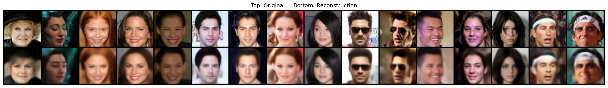
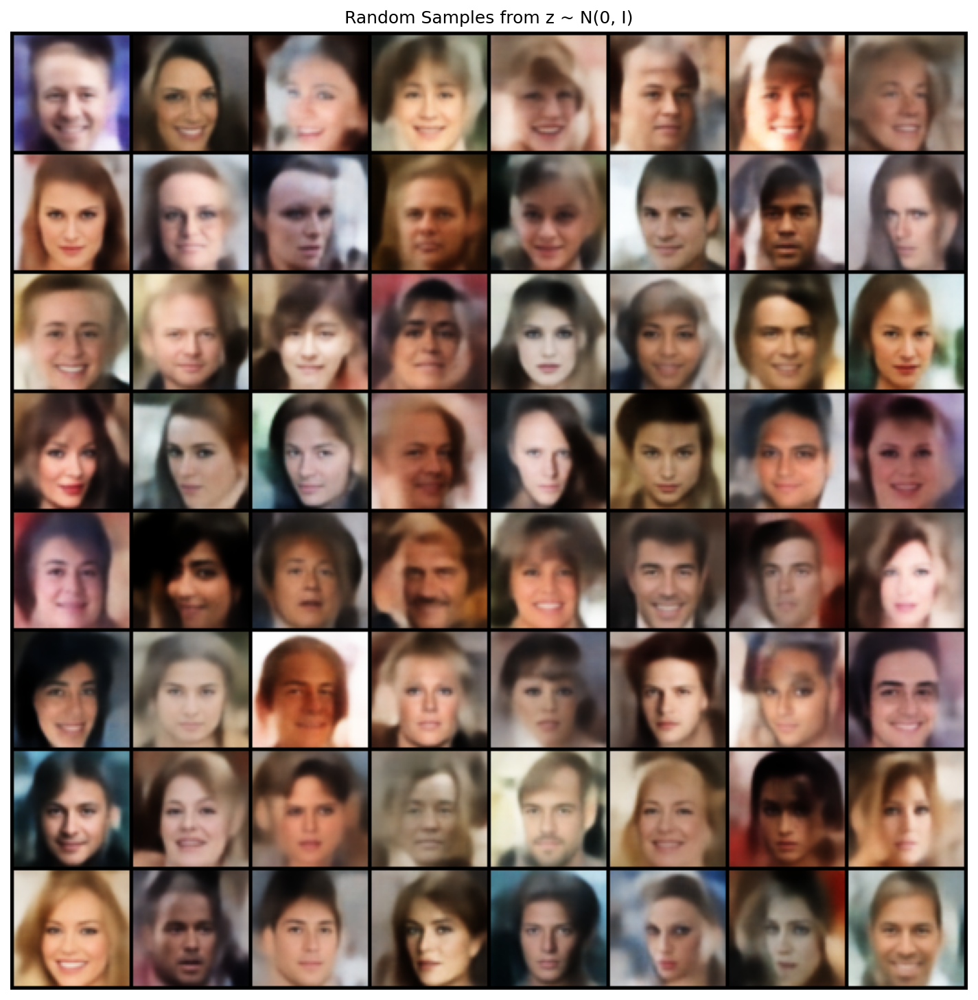
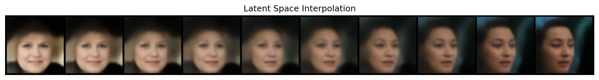
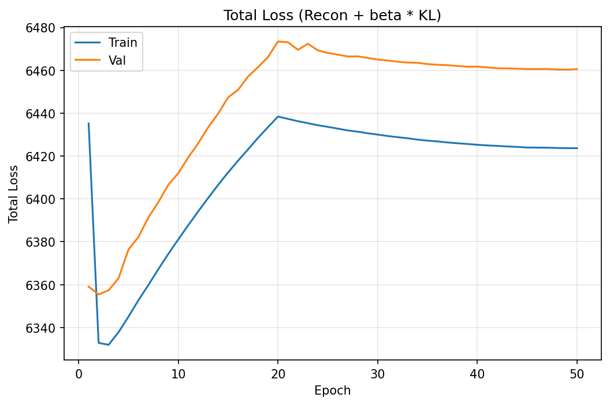
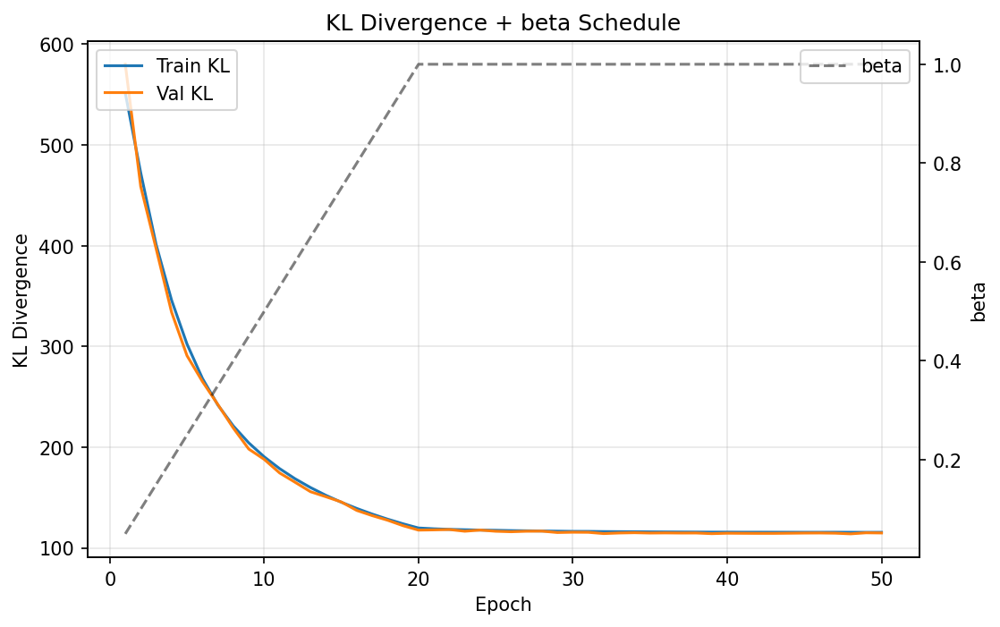
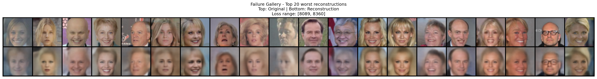

# VAE for CelebA Face Generation

Convolutional Variational Autoencoder trained on CelebA (64×64 RGB) for face reconstruction and generation.

## Dataset & Preprocessing

**CelebA** — 202,599 celebrity face images. Split: 162,770 train / 19,867 val / 19,962 test.

Preprocessing pipeline:
1. **Center crop 148×148** — removes background, keeps face region
2. **Resize to 64×64** — target resolution for the architecture
3. **ToTensor** — scales pixel values to [0, 1]

Images are cached as pre-processed tensors and memory-mapped at training time for fast I/O.

## Architecture

Symmetric convolutional encoder-decoder with reparameterization trick. **11.8M parameters**.

**Encoder** (6.95M params):
```
[B,3,64,64] → Conv(3→64) → Conv(64→128) → Conv(128→256) → Conv(256→512) → [B,512,4,4]
            → Flatten → Linear→μ [B,256], Linear→log_var [B,256]
```
Each conv block: Conv2d(4×4, stride=2, pad=1) + BatchNorm + LeakyReLU(0.2)

**Reparameterization:** z = μ + exp(0.5 · log_var) · ε, where ε ~ N(0, I)

**Decoder** (4.86M params):
```
[B,256] → Linear(256→8192) → Unflatten → [B,512,4,4]
        → ConvT(512→256) → ConvT(256→128) → ConvT(128→64) → ConvT(64→3) + Sigmoid → [B,3,64,64]
```
Each block: ConvTranspose2d(4×4, stride=2, pad=1) + BatchNorm + LeakyReLU(0.2). Final layer uses Sigmoid (no BatchNorm).

## Loss Design

**ELBO loss** = Reconstruction + β · KL divergence

- **Reconstruction:** Binary cross-entropy (BCE), summed over pixels, averaged over batch. Treats each pixel as independent Bernoulli. BCE penalizes confident wrong predictions more heavily than MSE, producing slightly sharper outputs.
- **KL divergence:** Closed-form KL between encoder posterior N(μ, σ²I) and prior N(0, I): KL = -0.5 · Σ[1 + log_var - μ² - exp(log_var)]

**Stability techniques:**
1. **KL warm-up** (β: 0→1 over 20 epochs) — prevents posterior collapse by suppressing KL while the decoder learns. Without it, the model minimizes loss by collapsing q(z|x) to the prior.
2. **Gradient clipping** (max_norm=5.0) — prevents destabilizing gradient spikes during the warm-up transition.

**Optimizer:** AdamW (lr=3e-4, weight_decay=1e-5) with CosineAnnealingLR.

## Results

### Quantitative Metrics

| Metric | Value |
|--------|-------|
| Test Reconstruction Loss (BCE) | 6,274.5 |
| Test KL Divergence | 114.9 |
| Test SSIM | **0.748** |

### Reconstructions (Test Set)

*Top: originals. Bottom: reconstructions. Identity, hair color, and expression are preserved. Fine details (accessories, text) are lost — expected VAE behavior. Age and Identity are not always preserved.*

### Random Samples from z ~ N(0, I)

*Generated faces show diversity in gender, skin tone, hair style, and expression. Blurriness is a fundamental VAE limitation (pixel-wise likelihood encourages mean predictions).*

### Latent Space Interpolation

*Smooth transition between two faces confirms the latent space is well-structured and continuous.*

### Training Curves
| | |
|:---:|:---:|
|  |  |

*Left: Total loss rises during warm-up (increasing β adds KL weight), then decreases as the model optimizes the full ELBO. Right: KL divergence drops as β increases, then stabilizes at ~115 — confirming no posterior collapse.*

## Failure Gallery

*Top: originals. Bottom: reconstructions. Loss range: 8,089 – 8,360.*

**Hypotheses for failure cases:**
- **Heavy shadows / dark lighting** — underrepresented in the training distribution; the decoder defaults to average lighting
- **Unusual head angles** — most CelebA images are near-frontal; extreme poses are harder to encode
- **Bright/overexposed backgrounds** — high-contrast transitions are difficult to reconstruct through the bottleneck
- **Accessories (hats, sunglasses)** — high-frequency details that the VAE's bottleneck cannot preserve

## Top Issues & Fixes

1. **Google Drive download failure** — CelebA's torchvision downloader failed due to quota limits. Fix: downloaded from Kaggle, wrote CSV→TXT conversion script (`scripts/prepare_celeba.py`), bypassed MD5 integrity check.

2. **Slow data loading (~20 min/epoch)** — Reading 162k individual JPEG files was I/O-bound. Fix: pre-cached all images as a single tensor file per split, loaded via `torch.load(mmap=True)` for memory-mapped access. Result: ~2.5 min/epoch.

3. **Total loss increasing during warm-up** — Not a bug. As β increases from 0→1, the KL term contributes more to total loss. After warm-up completes (epoch 20), total loss decreases as expected. The training curves clearly show this transition.

## Next Steps (Improving Sharpness & Diversity)

1. **Learned decoder variance** — Replace fixed Bernoulli likelihood with a Gaussian decoder that outputs per-pixel mean and variance. Allows the model to express uncertainty rather than averaging.
2. **VQ-VAE** — Replace continuous latent space with discrete codebook vectors. Eliminates blurriness from the continuous bottleneck.
3. **Hierarchical VAE (NVAE)** — Multiple levels of latent variables at different resolutions. Captures both global structure and fine details.
4. **Perceptual loss** — Add a VGG-based perceptual term to the reconstruction loss. Penalizes structural differences rather than pixel-wise errors.
5. **Larger resolution** — Train at 128×128 or 256×256 with a deeper network for more detail.

## Pre-trained Weights

Checkpoint files are too large for GitHub (~136 MB each). The final checkpoint (`checkpoint_epoch_050.pt`) is available upon request. Place it in `outputs/checkpoints/` to run evaluation without retraining.

## Reproducibility

```bash
# Setup
python3 -m venv env && source env/bin/activate
pip install -r requirements.txt

# Prepare CelebA (if downloaded from Kaggle)
python scripts/prepare_celeba.py

# Train
python train.py --config configs/default.yaml

# Evaluate
python evaluate.py --checkpoint outputs/checkpoints/checkpoint_epoch_050.pt
```

All hyperparameters are in `configs/default.yaml`. Random seed is fixed (42) for reproducibility.
